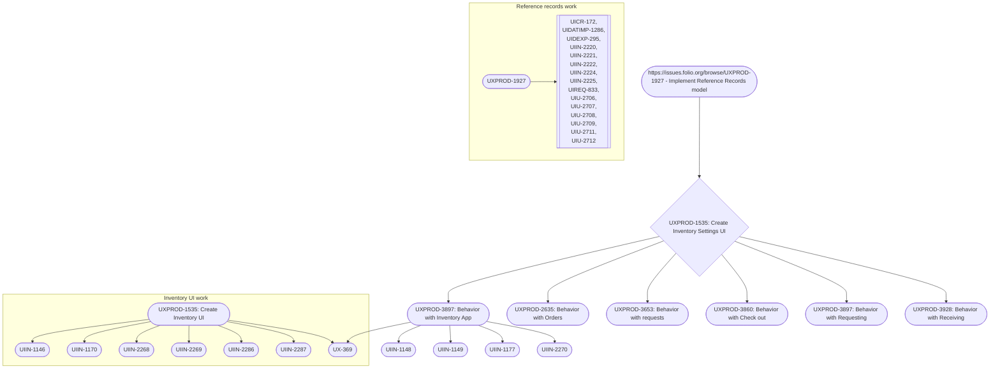

```mermaid


flowchart TD
	id1([https://issues.folio.org/browse/UXPROD-1927 - Implement Reference Records model]) --> id2{UXPROD-1535: Create Inventory Settings UI}
	id2 --> id8([UXPROD-3897: Behavior with Inventory App]) & id3([UXPROD-2635: Behavior with Orders]) & id4([UXPROD-3653: Behavior with requests]) & id5([UXPROD-3860: Behavior with Check out]) & id6([UXPROD-3897: Behavior with Requesting]) & id7([UXPROD-3928: Behavior with Receiving])
	id8 --> id9([UIIN-1148]) & id10([UIIN-1149]) & id11([UIIN-1177]) & id12([UIIN-2270]) & id127

	

	subgraph "Inventory UI work"
	id120([UXPROD-1535: Create Inventory UI]) --> id121([UIIN-1146]) & id122([UIIN-1170]) & id123([UIIN-2268]) & id124([UIIN-2269]) & id125([UIIN-2286]) & id126([UIIN-2287]) & id127([UX-369])
	end
	
	subgraph "Reference records work"
	direction LR
%%	id200([UXPROD-1927]) --> [["UICR-172, UIDATIMP-1286, UIDEXP-295, UIIN-2220, UIIN-2221, UIIN-2222, UIIN-2224, UIIN-2225"]]
	id200([UXPROD-1927]) --> id201[[UICR-172,<br/> UIDATIMP-1286,<br/> UIDEXP-295,<br/> UIIN-2220,<br/> UIIN-2221,<br/> UIIN-2222,<br/> UIIN-2224,<br/> UIIN-2225,<br/> UIREQ-833,<br/> UIU-2706,<br/> UIU-2707,<br/> UIU-2708,<br/> UIU-2709,<br/> UIU-2711,<br/> UIU-2712]]
	end

%%	subgraph "To be decided"
%%	id8([Serials behavior])
%%	end	

```
