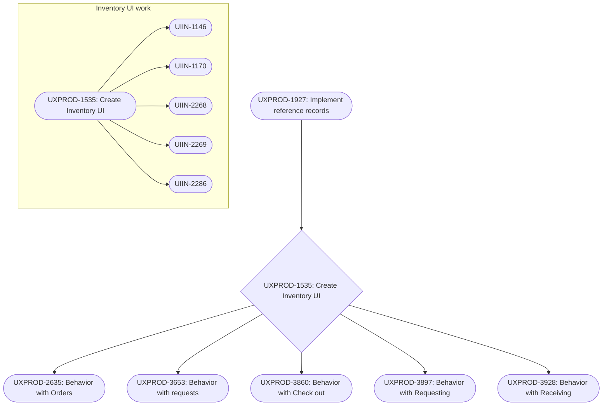

```mermaid


flowchart TD
	id1([UXPROD-1927: Implement reference records]) --> id2{UXPROD-1535: Create Inventory UI}
	id2 --> id3([UXPROD-2635: Behavior with Orders]) & id4([UXPROD-3653: Behavior with requests]) & id5([UXPROD-3860: Behavior with Check out]) & id6([UXPROD-3897: Behavior with Requesting]) & id7([UXPROD-3928: Behavior with Receiving])

	subgraph "Inventory UI work"
	direction LR
	id9([UXPROD-1535: Create Inventory UI]) --> id10([UIIN-1146]) & id11([UIIN-1170]) & id12([UIIN-2268]) & id13([UIIN-2269]) & id14([UIIN-2286])
	end

%%	subgraph "To be decided"
%%	id8([Serials behavior])
%%	end	

```
